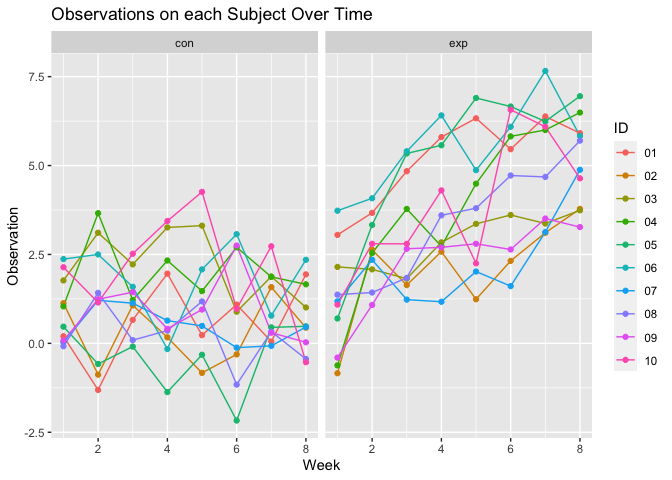

p8105_hw5_hj2660
================
Hyun Jin Jung
2023-11-15

# Problem 1

Describe the raw data.

``` r
homocide_df = read.csv("data-homicides-master/homicide-data.csv") 
```

Create a city_state variable (e.g. “Baltimore, MD”) and then summarize
within cities to obtain the total number of homicides and the number of
unsolved homicides (those for which the disposition is “Closed without
arrest” or “Open/No arrest”).

``` r
tidy_homocide = homocide_df |>
  mutate(city_state = str_c(city, state, sep = ","))

sum_homocide = tidy_homocide |>
  group_by(city_state) |>
  summarize(
    total_homocides = n(),
    total_unsolved_homocides = sum(disposition %in% c("Closed without arrest", "Open/No arrest"))
  )

sum_homocide
```

    ## # A tibble: 51 × 3
    ##    city_state     total_homocides total_unsolved_homocides
    ##    <chr>                    <int>                    <int>
    ##  1 Albuquerque,NM             378                      146
    ##  2 Atlanta,GA                 973                      373
    ##  3 Baltimore,MD              2827                     1825
    ##  4 Baton Rouge,LA             424                      196
    ##  5 Birmingham,AL              800                      347
    ##  6 Boston,MA                  614                      310
    ##  7 Buffalo,NY                 521                      319
    ##  8 Charlotte,NC               687                      206
    ##  9 Chicago,IL                5535                     4073
    ## 10 Cincinnati,OH              694                      309
    ## # ℹ 41 more rows

For the city of Baltimore, MD, use the prop.test function to estimate
the proportion of homicides that are unsolved; save the output of
prop.test as an R object, apply the broom::tidy to this object and pull
the estimated proportion and confidence intervals from the resulting
tidy dataframe.

``` r
baltimore_df =
  sum_homocide |>
  filter(city_state == "Baltimore,MD") 

baltimore_result = prop.test(
  x = baltimore_df$total_unsolved_homocides,
  n = baltimore_df$total_homocides)

#apply broom::tidy and pull the estimated proportion and CI intervals
baltimore_tidy_result =
  broom::tidy(baltimore_result) |>
  select(estimate, conf.low, conf.high)

baltimore_tidy_result
```

    ## # A tibble: 1 × 3
    ##   estimate conf.low conf.high
    ##      <dbl>    <dbl>     <dbl>
    ## 1    0.646    0.628     0.663

The estimated proportion is 0.646, and its 95% confidence interval is
\[0.628, 0.663\].

Now run prop.test for each of the cities in your dataset, and extract
both the proportion of unsolved homicides and the confidence interval
for each. Do this within a “tidy” pipeline, making use of purrr::map,
purrr::map2, list columns and unnest as necessary to create a tidy
dataframe with estimated proportions and CIs for each city.

``` r
city_prop = sum_homocide |>
  group_by(city_state)
```

Create a plot that shows the estimates and CIs for each city – check out
geom_errorbar for a way to add error bars based on the upper and lower
limits. Organize cities according to the proportion of unsolved
homicides.

# Problem 2

This zip file contains data from a longitudinal study that included a
control arm and an experimental arm. Data for each participant is
included in a separate file, and file names include the subject ID and
arm.

Create a tidy dataframe containing data from all participants, including
the subject ID, arm, and observations over time:

Start with a dataframe containing all file names; the list.files
function will help

``` r
comb_df = 
  tibble(
    files = list.files("data/"),
    path = str_c("data/", files)
  ) |> 
  mutate(data = map(path, read_csv)) |> 
  unnest()
```

Iterate over file names and read in data for each subject using
purrr::map and saving the result as a new variable in the dataframe

Tidy the result; manipulate file names to include control arm and
subject ID, make sure weekly observations are “tidy”, and do any other
tidying that’s necessary

``` r
tidy_df = comb_df |> 
  mutate(
    files = str_replace(files, ".csv", ""),
    group = str_sub(files, 1, 3),
    ID = str_sub(files, 5, 6)) |>
  pivot_longer(week_1:week_8,names_to = "week", values_to = "observation",names_prefix = "week_") |>
  mutate(week = as.numeric(week)) |>
  select(group, ID, week, observation)

tidy_df
```

    ## # A tibble: 160 × 4
    ##    group ID     week observation
    ##    <chr> <chr> <dbl>       <dbl>
    ##  1 con   01        1        0.2 
    ##  2 con   01        2       -1.31
    ##  3 con   01        3        0.66
    ##  4 con   01        4        1.96
    ##  5 con   01        5        0.23
    ##  6 con   01        6        1.09
    ##  7 con   01        7        0.05
    ##  8 con   01        8        1.94
    ##  9 con   02        1        1.13
    ## 10 con   02        2       -0.88
    ## # ℹ 150 more rows

Make a spaghetti plot showing observations on each subject over time,
and comment on differences between groups.

``` r
spagetti_plot = tidy_df |>
  ggplot(aes(x = week, y = observation, color = ID)) +
  geom_line() +
  geom_point() + 
  facet_grid(~group) +
  labs(x = 'Week', y = 'Observation', title = 'Observations on each Subject Over Time') +
  theme_minimal()

spagetti_plot
```

<!-- -->

Within the control group, observations for each subject fluctuate around
a consistent value, while the experimental group exhibits a noticeable
trend of increasing observations among subjects as the weeks progress.

## Problem 3

``` r
set.seed(12345)
```

We define a function that conducts a one-sample t-test with parameters
set to n = 30, mu = 0, sigma = 5, and a significance level of 0.05.

``` r
t_test_sim = function(n = 30, mu = mu, sd = 5) {
  data = tibble(
    x = rnorm(n = 30, mean = mu, sd = 5))
  t_test = 
    t.test(pull(data, x), mean = 0, conf.level = 1 - 0.05) |>
    broom::tidy()
  
  return(tibble(
    mu = mu,
    mu_hat = pull(t_test, estimate),
    p_value = pull(t_test, p.value)))
}

t_test_sim(mu = 0)
```

    ## # A tibble: 1 × 3
    ##      mu mu_hat p_value
    ##   <dbl>  <dbl>   <dbl>
    ## 1     0  0.394   0.649

Run the test 5000 times.

``` r
output = vector("list", 5000)

for (i in 1:5000) {
  output[[i]] = t_test_sim(n = 30, mu = 0, sd = 5)
}

sim_results_mu_0 = bind_rows(output)

sim_results_mu_0
```

    ## # A tibble: 5,000 × 3
    ##       mu  mu_hat p_value
    ##    <dbl>   <dbl>   <dbl>
    ##  1     0  1.56    0.195 
    ##  2     0  2.18    0.0363
    ##  3     0  0.126   0.895 
    ##  4     0 -0.278   0.806 
    ##  5     0  0.0257  0.978 
    ##  6     0  0.686   0.341 
    ##  7     0  0.280   0.765 
    ##  8     0  0.0198  0.981 
    ##  9     0 -0.919   0.269 
    ## 10     0  1.64    0.0917
    ## # ℹ 4,990 more rows

Repeat the above for μ={1,2,3,4,5,6}.

``` r
sim_results_all =
  expand_grid(
    mu_values = 0:6,
    iter = 1:5000) |>
  mutate(
    estimate_df = pmap(list(n = 30, mu = mu_values), t_test_sim)) |>
  unnest(estimate_df)
```

Make a plot showing the proportion of times the null was rejected (the
power of the test) on the y axis and the true value of μ on the x axis.
Describe the association between effect size and power. Make a plot
showing the average estimate of μ̂ on the y axis and the true value of μ
on the x axis. Make a second plot (or overlay on the first) the average
estimate of μ̂ only in samples for which the null was rejected on the y
axis and the true value of μ on the x axis. Is the sample average of μ̂
across tests for which the null is rejected approximately equal to the
true value of μ ? Why or why not?
