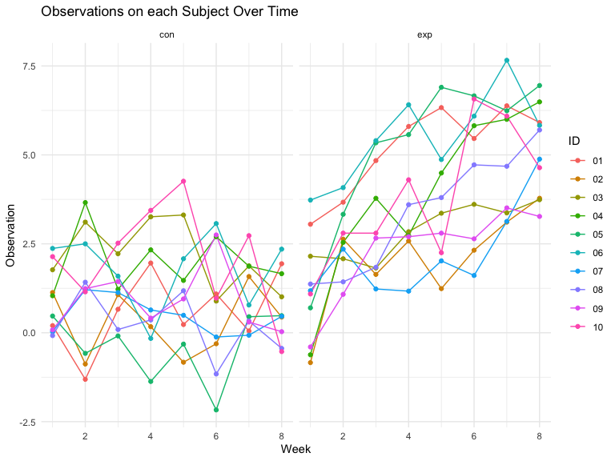
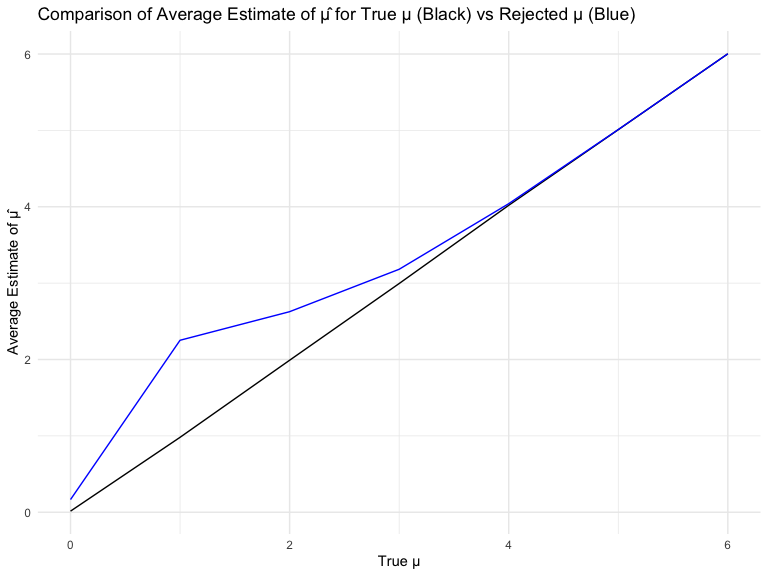

p8105_hw5_hj2660
================
Hyun Jin Jung
2023-11-15

# Problem 1

``` r
homicide_df = 
  read_csv("data-homicides-master/homicide-data.csv", na = c("", "NA", "Unknown")) %>%
  mutate(
    city_state = str_c(city, state, sep = ", "),
    resolution = case_when(
      disposition == "Closed without arrest" ~ "unsolved",
      disposition == "Open/No arrest"        ~ "unsolved",
      disposition == "Closed by arrest"      ~ "solved"
    )
  ) %>% 
  filter(city_state != "Tulsa, AL") 
```

    ## Rows: 52179 Columns: 12
    ## ── Column specification ────────────────────────────────────────────────────────
    ## Delimiter: ","
    ## chr (8): uid, victim_last, victim_first, victim_race, victim_sex, city, stat...
    ## dbl (4): reported_date, victim_age, lat, lon
    ## 
    ## ℹ Use `spec()` to retrieve the full column specification for this data.
    ## ℹ Specify the column types or set `show_col_types = FALSE` to quiet this message.

``` r
city_homicide_df = 
  homicide_df %>% 
  select(city_state, disposition, resolution) %>% 
  group_by(city_state) %>% 
  summarize(
    hom_total = n(),
    hom_unsolved = sum(resolution == "unsolved"))
```

``` r
bmore_test = 
  prop.test(
    x = filter(city_homicide_df, city_state == "Baltimore, MD") %>% pull(hom_unsolved),
    n = filter(city_homicide_df, city_state == "Baltimore, MD") %>% pull(hom_total)) 

broom::tidy(bmore_test) %>% 
  knitr::kable(digits = 3)
```

| estimate | statistic | p.value | parameter | conf.low | conf.high | method                                               | alternative |
|---------:|----------:|--------:|----------:|---------:|----------:|:-----------------------------------------------------|:------------|
|    0.646 |   239.011 |       0 |         1 |    0.628 |     0.663 | 1-sample proportions test with continuity correction | two.sided   |

``` r
test_results = 
  city_homicide_df %>% 
  mutate(
    prop_tests = map2(hom_unsolved, hom_total, \(x, y) prop.test(x = x, n = y)),
    tidy_tests = map(prop_tests, broom::tidy)) %>% 
  select(-prop_tests) %>% 
  unnest(tidy_tests) %>% 
  select(city_state, estimate, conf.low, conf.high) %>% 
  mutate(city_state = fct_reorder(city_state, estimate))
```

``` r
test_results %>% 
  mutate(city_state = fct_reorder(city_state, estimate)) %>% 
  ggplot(aes(x = city_state, y = estimate)) + 
  geom_point() + 
  geom_errorbar(aes(ymin = conf.low, ymax = conf.high)) + 
  theme(axis.text.x = element_text(angle = 90, hjust = 1))
```

<!-- -->

# Problem 2

Combine files from a study that includes a control arm and an
experimental arm.

``` r
comb_df = 
  tibble(
    files = list.files("data/"),
    path = str_c("data/", files)
  ) |> 
  mutate(data = map(path, read_csv)) |> 
  unnest()
```

Create a data frame by collecting file names and paths using
`list.files`. Use `purrr::map` to import each CSV file into the data
frame, saving their data as a new variable within the frame.

Tidy the dataset

``` r
tidy_df = comb_df |> 
  mutate(
    files = str_replace(files, ".csv", ""),
    group = str_sub(files, 1, 3),
    ID = str_sub(files, 5, 6)) |>
  pivot_longer(week_1:week_8,names_to = "week", values_to = "observation",names_prefix = "week_") |>
  mutate(week = as.numeric(week)) |>
  select(group, ID, week, observation)

tidy_df
```

    ## # A tibble: 160 × 4
    ##    group ID     week observation
    ##    <chr> <chr> <dbl>       <dbl>
    ##  1 con   01        1        0.2 
    ##  2 con   01        2       -1.31
    ##  3 con   01        3        0.66
    ##  4 con   01        4        1.96
    ##  5 con   01        5        0.23
    ##  6 con   01        6        1.09
    ##  7 con   01        7        0.05
    ##  8 con   01        8        1.94
    ##  9 con   02        1        1.13
    ## 10 con   02        2       -0.88
    ## # ℹ 150 more rows

Make a spaghetti plot

``` r
spagetti_plot = tidy_df |>
  ggplot(aes(x = week, y = observation, color = ID)) +
  geom_line() +
  geom_point() + 
  facet_grid(~group) +
  labs(x = 'Week', y = 'Observation', title = 'Observations on each Subject Over Time') +
  theme_minimal()

spagetti_plot
```

<!-- -->
Within the control group, observations for each subject fluctuate around
a consistent value, while the experimental group exhibits a noticeable
trend of increasing observations among subjects as the weeks progress.

## Problem 3

``` r
set.seed(12345)
```

We define a function that conducts a `one-sample t-test` with parameters
set to *n = 30, mu = 0, sigma = 5, and a significance level of 0.05*.

``` r
t_test_sim = function(n = 30, mu = mu, sd = 5) {
  data = tibble(
    x = rnorm(n = 30, mean = mu, sd = 5))
  t_test = 
    t.test(pull(data, x), mean = 0, conf.level = 1 - 0.05) |>
    broom::tidy()
  
  return(tibble(
    mu = mu,
    mu_hat = pull(t_test, estimate),
    p_value = pull(t_test, p.value)))
}

t_test_sim(mu = 0)
```

    ## # A tibble: 1 × 3
    ##      mu mu_hat p_value
    ##   <dbl>  <dbl>   <dbl>
    ## 1     0  0.394   0.649

Run the test 5000 times.

``` r
output = vector("list", 5000)

for (i in 1:5000) {
  output[[i]] = t_test_sim(n = 30, mu = 0, sd = 5)
}

sim_results_mu_0 = bind_rows(output)

sim_results_mu_0
```

    ## # A tibble: 5,000 × 3
    ##       mu  mu_hat p_value
    ##    <dbl>   <dbl>   <dbl>
    ##  1     0  1.56    0.195 
    ##  2     0  2.18    0.0363
    ##  3     0  0.126   0.895 
    ##  4     0 -0.278   0.806 
    ##  5     0  0.0257  0.978 
    ##  6     0  0.686   0.341 
    ##  7     0  0.280   0.765 
    ##  8     0  0.0198  0.981 
    ##  9     0 -0.919   0.269 
    ## 10     0  1.64    0.0917
    ## # ℹ 4,990 more rows

Repeat the above for μ={1,2,3,4,5,6}.

``` r
sim_results_all =
  expand_grid(
    mu_values = 0:6,
    iter = 1:5000) |>
  mutate(
    estimate_df = pmap(list(n = 30, mu = mu_values), t_test_sim)) |>
  unnest(estimate_df)
```

Make a plot showing the proportion of times the null was rejected (the
power of the test) on the y axis and the true value of μ on the x axis.
Describe the association between effect size and power.

``` r
sim_results_all |>
  mutate(null_rejected = as.integer(p_value < 0.05)) |>
  group_by(mu) |>
  summarize(proportion = mean(null_rejected)) |>
  ggplot(aes(x = mu, y = proportion)) +
  geom_point() +
  geom_line() +
  labs(
    title = "Power vs True μ",
    x = "True μ",
    y = "Power") +
  theme_minimal()
```

<!-- -->
The power increases as the true value of µ rises. Once the true value of
µ exceeds 4, the power approximates at 1. However, when the true value
of µ is small, the power remains consistently low.

``` r
all_avg =
  sim_results_all |>
  group_by(mu) |>
  summarize(mean_mu = mean(mu_hat))

rej_avg =
  sim_results_all |>
  filter(p_value < 0.05) |>
  group_by(mu) |>
  summarize(mean_mu = mean(mu_hat))

ggplot(all_avg, aes(x = mu, y = mean_mu)) +
  geom_line() +
  geom_line(data = rej_avg, aes(y = mean_mu), color = "blue") +
  labs(
    title = "Comparison of Average Estimate of μ̂ for True μ (Black) vs Rejected μ (Blue)",
    x = "True μ",
    y = "Average Estimate of μ̂"
  ) +
  theme_minimal()
```

<!-- -->
The plot illustrates two lines: a black line representing all samples
where the average estimate of μ is very close to the true value, and a
blue line representing samples with rejected null hypotheses (p-value \<
0.05).

For a true μ of 0, the average estimate of μ_hat across rejected tests
is approximately not equal to the true μ. When the true mean is between
1 and 4, average estimates of rejected tests consistently exceed the
true mean, suggesting low power at small effect sizes. When the true
mean exceeds 4, the average estimates align closely with the true mean.
The average μ_hat values of rejected tests diverge from the true μ
values between 0 and 3 but begin to approximate them around 4.
